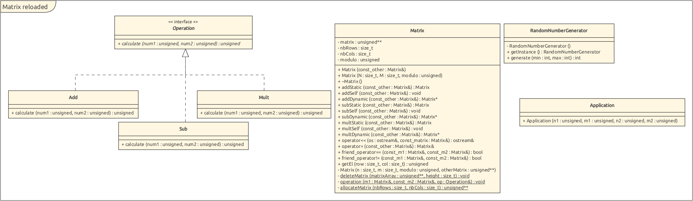

# POA labo1 - Matrix Reloaded
## Diagramme de classe

## Choix de modélisation

Les différentes opérations d'addition, de soustraction et de multiplication nécessitaient toutes une implémentation très similaire. Nous avons donc choisi de factoriser leur code et d'utiliser une méthode privée et statique `operation` prenant en paramètre les deux matrices ainsi qu'une référence sur un objet de l'opération en question. Cette dernière ne retourne aucun objet mais modifie la première matrice par paramètre. Cela nous permet ainsi d'utiliser cette unique méthodes pour les différentes opérations, qu'elles soient statiques, appliquées à l'objet lui-même ou dynamique.

En ce qui concerne les possibles erreurs de paramètres des différentes méthodes, nous soulevons une exception lorsqu'un des paramètres viole une erreur de logique (ex : nombre de lignes ou de colonnes nul) et dans le cas où un pointeur serait nul. Nous avons fait l'hypothèse que l'utilisateur ne passerait pas de référence nulle par paramètre.

Les soustraction sont effectuées sur des valeurs de type `unsigned`. Ainsi, lors d'une soustraction x1 - x2, en considérant que la valeur x2 est supérieure à x1, le résultat est obtenu par cyclicité et mis au modulo. Les valeurs finales sont donc bien entre 0 et modulo - 1.

## Tests

### Constructeur

| Fonction testée | Intitulé du test | Résultat attendu | Résultat obtenu |
|----------|-------------|:------:|:------:|
| Constructeur aléatoire | Construction d'une matrice avec un nombre de lignes et de colonnes strictement positifs | ok | ok |
| Constructeur aléatoire | Construction d'une matrice avec un nombre de lignes de 0 et un nombre de colonnes strictement positif | failed | failed |
| Constructeur aléatoire | Construction d'une matrice avec un nombre de colonnes de 0 et un nombre de lignes strictement positif | failed | failed |
| Constructeur de copie | Construction d'une matrice avec un nombre de lignes et de colonnes strictement positif avec le constructeur de copie | ok | ok |

### Opérateurs

| Fonction testée | Intitulé du test | Résultat attendu | Résultat obtenu |
|----------|-------------|:------:|:------:|
| Opérateur d'affectation | Affectation d'une matrice avec une autre matrice | ok | ok |

### Addition

| Fonction testée | Intitulé du test | Résultat attendu | Résultat obtenu |
|----------|-------------|:------:|:------:|
| Addition statique | Addition statique entre 2 matrices de mêmes tailles | ok | ok |
| Addition statique | Addition statique entre 2 matrices de différentes tailles | ok | ok |
| Addition statique | Addition statique entre 2 matrices de modulos différents | failed | failed |
| Addition self | Addition self entre 2 matrices de mêmes tailles | ok | ok |
| Addition self | Addition self entre 2 matrices de différentes tailles | ok | ok |
| Addition self | Addition self entre 2 matrices de modulos différents | failed | failed |
| Addition dynamique | Addition dynamique entre 2 matrices de mêmes tailles | ok | ok |
| Addition dynamique | Addition dynamique entre 2 matrices de différentes tailles | ok | ok |
| Addition dynamique | Addition dynamique entre 2 matrices de modulos différents | failed | failed |

### Soustraction

| Fonction testée | Intitulé du test | Résultat attendu | Résultat obtenu |
|----------|-------------|:------:|:------:|
| Soustraction statique | Soustraction statique entre 2 matrices de mêmes tailles | ok | ok |
| Soustraction statique | Soustraction statique entre 2 matrices de différentes tailles | ok | ok |
| Soustraction statique | Soustraction statique entre 2 matrices de modulos différents | failed | failed |
| Soustraction self | Soustraction self entre 2 matrices de mêmes tailles | ok | ok |
| Soustraction self | Soustraction self entre 2 matrices de différentes tailles | ok | ok |
| Soustraction self | Soustraction self entre 2 matrices de modulos différents | failed | failed |
| Soustraction dynamique | Soustraction dynamique entre 2 matrices de mêmes tailles | ok | ok |
| Soustraction dynamique | Soustraction dynamique entre 2 matrices de différentes tailles | ok | ok |
| Soustraction dynamique | Soustraction dynamique entre 2 matrices de modulos différents | failed | failed |

### Multiplication

| Fonction testée | Intitulé du test | Résultat attendu | Résultat obtenu |
|----------|-------------|:------:|:------:|
| Multiplication statique | Multiplication statique entre 2 matrices de mêmes tailles | ok | ok |
| Multiplication statique | Multiplication statique entre 2 matrices de différentes tailles | ok | ok |
| Multiplication statique | Multiplication statique entre 2 matrices de modulos différents | failed | failed |
| Multiplication self | Multiplication self entre 2 matrices de mêmes tailles | ok | ok |
| Multiplication self | Multiplication self entre 2 matrices de différentes tailles | ok | ok |
| Multiplication self | Multiplication self entre 2 matrices de modulos différents | failed | failed |
| Multiplication dynamique | Multiplication dynamique entre 2 matrices de mêmes tailles | ok | ok |
| Multiplication dynamique | Multiplication dynamique entre 2 matrices de différentes tailles | ok | ok |
| Multiplication dynamique | Multiplication dynamique entre 2 matrices de modulos différents | failed | failed |
